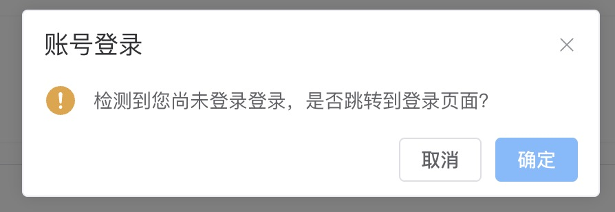

# 本地开发

## 前端 Proxy

需要对 devServer 设置 Proxy 属性，对组件内置请求的 api 和 server 进行代理，解决本地开发的跨域问题，`vite.config.ts` 加入如下代码：

```js
  const serverAddress = 'http://10.224.32.144:8080/'; // 后端地址

  server: {
    port: 3000,
    proxy: {
      "/api": {
        target: serverAddress,
        changeOrigin: true,
        secure: false,
      },
      '/server': {
        target: serverAddress,
        changeOrigin: true,
        secure: false,
      },
    },
  },
```

## 后端配置

注意：`callBackUrl` 的端口需要与[前端 Proxy](../guide/local.html#前端-proxy)中`server.port`端口一致，示例如下

```yaml
maxtropy:
  openplatform:
    ...

    integratedCoreUri: true
    callBackUrl: http://localhost:3000/server/callback # 前端 Proxy 中 server.port 端口

    ...
    whiteList:
      - /api/test
```

## 检测登录态

当内置接口检测未登录时，会弹出框提示，点击确定后会跳转到登录页进行登录，登录后会跳转到选择租户页面，选择租户后会跳转到原页面。



注意：生产环境下也会检测登录态，但不会弹出框提示，而是直接跳转到登录页。
